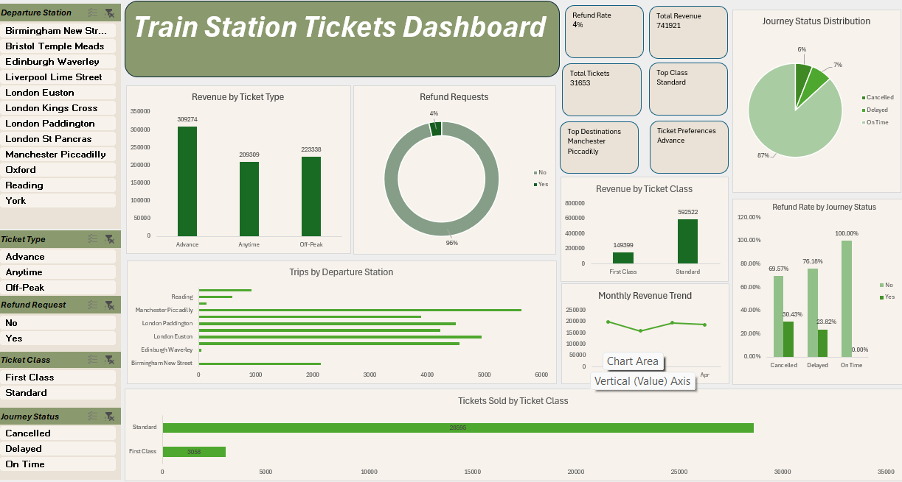

# Train Station Tickets Dashboard 🚆

An interactive Excel dashboard designed to monitor ticket operations, revenue, and travel patterns.

## 🎯 Features

* **Core Metrics Tracking:** Monitor total revenue, refund rates, total tickets, and journey status distribution in real-time.
* **Interactive Slicers:** Dynamic filtering capabilities by Departure Station, Ticket Type, Refund Request, Ticket Class, and Journey Status.
* **Revenue & Trend Analysis:** Visual breakdowns of revenue by ticket type and class, combined with monthly revenue trends.
* **Operational Performance:** Analyze station trip volumes and refund rates against journey statuses.

## 🛠️ Built With

* **Microsoft Excel:** Dashboard design, layout, and formatting.
* **Data Visualization:** Column charts, bar charts, pie charts, and line charts.
* **Data Filtering:** Interactive Slicers for dynamic exploration.

## 📊 Dashboard Preview

